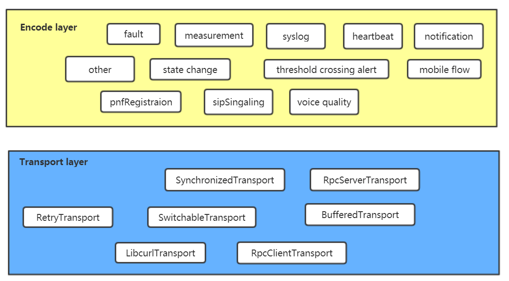
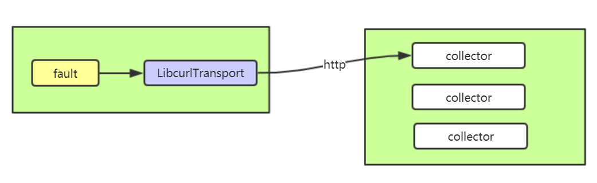
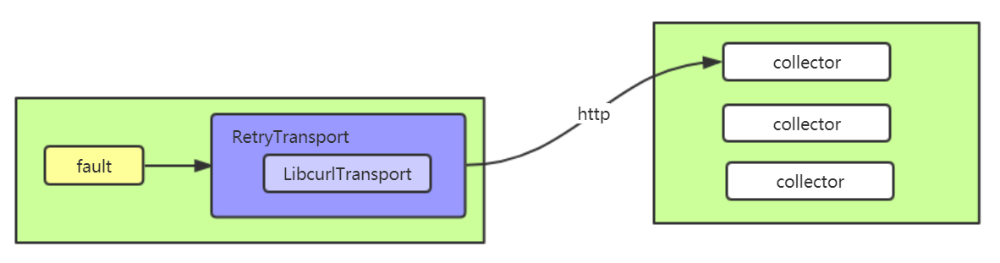
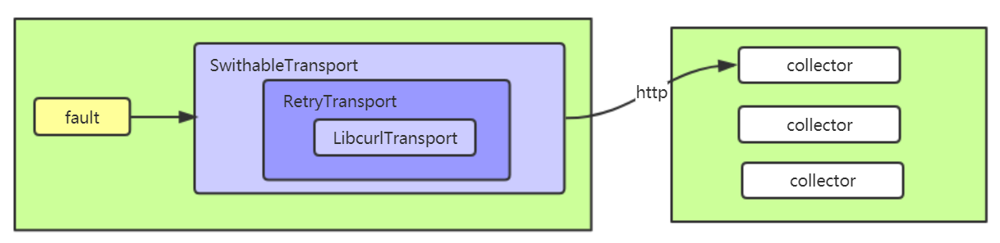
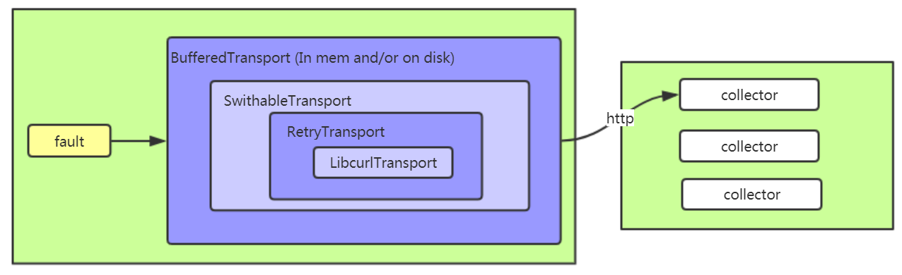
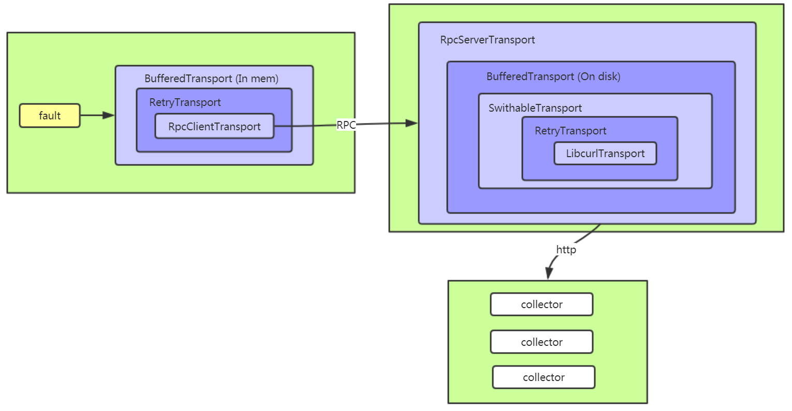

# Xvesagent
A C++ implement of ATT Services Spec
===
Xvesagent provides 2 independent modules:
* **xencode**: encode structure event to json string.
* **xtransport**: post json string to collector.

# Build

## build dependency
[**json**](https://github.com/nlohmann/json) for encoding.
```
git clone https://github.com/nlohmann/json.git
cd json
mkdir _build
cd _build
cmake .. -DJSON_BuildTests=OFF
make
make install
```
[**spdlog**](https://github.com/gabime/spdlog) for logging.
```
git clone https://github.com/gabime/spdlog.git
cd spdlog
mkdir _build
cd _build
cmake .. -DSPDLOG_BUILD_EXAMPLES=OFF -DSPDLOG_BUILD_BENCH=OFF -DSPDLOG_BUILD_TESTS=OFF
make
make install
```
[**thrift**](https://github.com/apache/thrift) for RPC.
```
git clone https://github.com/apache/thrift.git
cd thrift
mkdir _build
cd _build
cmake .. -DBUILD_PYTHON=OFF -DBUILD_JAVA=OFF -DBUILD_C_GLIB=OFF -DWITH_LIBEVENT=OFF -DWITH_ZLIB=OFF -DWITH_OPENSSL=OFF -DBUILD_TESTING=OFF -DCMAKE_POSITION_INDEPENDENT_CODE=ON
make
make install
```
[**leveldb**](https://github.com/google/leveldb) for buffering.
```
git clone https://github.com/google/leveldb.git
mkdir _build
cd _build
cmake .. -DCMAKE_POSITION_INDEPENDENT_CODE=ON
make
make install
```

## build xencode and xtransport
```
git clone https://github.com/xuyatian/xvesagent.git
cd xvesagent/src
mkdir _build
cd _build
cmake ..
make
make install
```

# Usage samples:
## Build event(fault)
``` c++
    auto header = XCommonEventHeader::create(
        "EventName",
        "EventId",
        "SourceName",
        "ReportName",
        XEnumCommonEventHeaderPriorityNormal,
        111
        );

    auto fault = XFaultFields::create(header,
        "condition",
        "specProblem",
        XEnumFaultFieldsEventSourceTypeVirtualMachine,
        XEnumFaultFieldsEventSeverityNORMAL,
        XEnumFaultFieldsVfStatusActive);

    fault->setAlarmInterfaceA("Interface");
    fault->setEventSeverity(XEnumFaultFieldsEventSeverityMAJOR);
    fault->setAlarmCondition("XXCondition");
    fault->setVfStatus(XEnumFaultFieldsVfStatusRequestingTermination);
    fault->setEventCategory("Category");
    fault->setEventSourceType(XEnumFaultFieldsEventSourceTypeVirtualMachine);
    fault->setSpecificProblem("XXProblem");
    XHashMap hm{ { "xxx","123" },{ "yyy","456" } };
    fault->setAlarmAdditionalInformation(hm);

    cout << fault->toString() << endl;
```
## Post fault to collector

``` c++
void testLibcurlTransport()
{
    auto event = buildFault();

    XTransportOption opt;
    opt.url_ = "http://127.0.0.1:30000";

    auto transport = XTransport::LibCurlTransport(opt);

    transport->start();

    transport->post(event->toString());

    transport->stop();
}
```
## Post fault to collector(with retry)

``` c++
void testRetryTransport()
{
    auto event = buildFault();

    XTransportOption opt;
    opt.url_ = "http://127.0.0.1:30000";

    auto transport = XTransport::RetryTransport(XTransport::LibCurlTransport(opt),
        seconds(3),
        5);

    transport->start();

    for (int i=0; i<10; i++)
    {
        transport->post(event->toString());
        this_thread::sleep_for(seconds(10));
    }

    transport->stop();
}
```
## Post fault to collector(with retry and switch)

``` c++
void testSwitchableTransport()
{
    auto event = buildFault();

    vector<shared_ptr<XTransport>> transports;

    XTransportOption opt;
    opt.url_ = "http://127.0.0.1:30000";
    auto transport1 = XTransport::RetryTransport(XTransport::LibCurlTransport(opt), 
        seconds(3), 
        3);
    transports.push_back(transport1);

    opt.url_ = "http://127.0.0.1:30001";
    auto transport2 = XTransport::RetryTransport(XTransport::LibCurlTransport(opt), 
        seconds(3), 
        3);
    transports.push_back(transport2);

    auto transport = XTransport::SwitchableTransport(transports);

    transport->start();

    for (int i=0; i<10; i++)
    {
        transport->post(event->toString());
        this_thread::sleep_for(seconds(10));
    }

    transport->stop();
}
``` 
## Post fault to collector(with buffer)

``` c++
void testMemBufferedTransport()
{
    auto event = buildFault();

    vector<shared_ptr<XTransport>> transports;

    XTransportOption opt;
    opt.url_ = "http://127.0.0.1:30000";
    auto transport1 = XTransport::RetryTransport(XTransport::LibCurlTransport(opt), 
        seconds(3), 
        3);
    transports.push_back(transport1);

    opt.url_ = "http://127.0.0.1:30001";
    auto transport2 = XTransport::RetryTransport(XTransport::LibCurlTransport(opt), 
        seconds(3), 
        3);
    transports.push_back(transport2);

    auto que = XQueue::create(1000);
    auto transport = XTransport::BufferedTransport(XTransport::SwitchableTransport(transports),
        que);

    transport->start();

    for (int i=0; i<1200; i++)
    {
        transport->post(event->toString());
    }

    this_thread::sleep_for(seconds(10));

    transport->stop();
}

void testDiskBufferedTransport()
{
    auto event = buildFault();

    vector<shared_ptr<XTransport>> transports;

    XTransportOption opt;
    opt.url_ = "http://127.0.0.1:30000";
    auto transport1 = XTransport::RetryTransport(XTransport::LibCurlTransport(opt), 
        seconds(3), 
        3);
    transports.push_back(transport1);

    opt.url_ = "http://127.0.0.1:30001";
    auto transport2 = XTransport::RetryTransport(XTransport::LibCurlTransport(opt), 
        seconds(3), 
        3);
    transports.push_back(transport2);

    auto que = XQueue::create("/tmp");
    auto transport = XTransport::BufferedTransport(XTransport::SwitchableTransport(transports),
        que);

    transport->start();

    for (int i=0; i<10000; i++)
    {
        transport->post(event->toString());
    }

    this_thread::sleep_for(seconds(30));

    transport->stop();
}
```
## Post fault via agent

client
``` c++
void testRpcClientTransport()
{
    auto event = buildFault();

    XTransportOption rpcOpt;
    rpcOpt.host_ = "127.0.0.1";
    rpcOpt.port_ = 5678;

    auto retryTransport = XTransport::RetryTransport(XTransport::RpcClientTransport(rpcOpt),
        seconds(3),
        5);
    auto transport = XTransport::BufferedTransport(retryTransport, 
        XQueue::create(1000)
        );

    transport->start();

    for (int i=0; i<100; i++)
    {
        transport->post(event->toString());
        this_thread::sleep_for(milliseconds(200));
    }

    this_thread::sleep_for(seconds(10));

    transport->stop();
}
```
server (agent)
``` c++
void testRpcServerTransport()
{
    vector<shared_ptr<XTransport>> transports;

    XTransportOption opt;
    opt.url_ = "http://127.0.0.1:30000";
    auto transport1 = XTransport::RetryTransport(XTransport::LibCurlTransport(opt), 
        seconds(3), 
        3);
    transports.push_back(transport1);

    opt.url_ = "http://127.0.0.1:30001";
    auto transport2 = XTransport::RetryTransport(XTransport::LibCurlTransport(opt), 
        seconds(3), 
        3);
    transports.push_back(transport2);

    auto que = XQueue::create("/tmp");
    auto bufferedTransport = XTransport::BufferedTransport(XTransport::SwitchableTransport(transports),
        que);

    XTransportOption rpcOpt;
    rpcOpt.port_ = 5678;

    auto transport = XTransport::RpcServerTransport(bufferedTransport, rpcOpt);

    transport->start();

    this_thread::sleep_for(minutes(10));

    transport->stop();
} 
```
# License
Licensed to the Apache Software Foundation (ASF) under one or more contributor license agreements. See the NOTICE file distributed with this work for additional information regarding copyright ownership. The ASF licenses this file to you under the Apache License, Version 2.0 (the "License"); you may not use this file except in compliance with the License. You may obtain a copy of the License at

http://www.apache.org/licenses/LICENSE-2.0

Unless required by applicable law or agreed to in writing, software distributed under the License is distributed on an "AS IS" BASIS, WITHOUT WARRANTIES OR CONDITIONS OF ANY KIND, either express or implied. See the License for the specific language governing permissions and limitations under the License.
